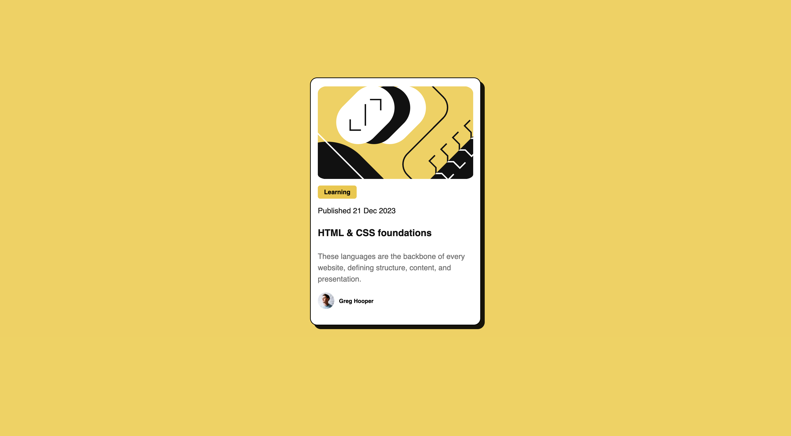

# Frontend Mentor - Blog preview card solution

This is a solution to the [Blog preview card challenge on Frontend Mentor](https://www.frontendmentor.io/challenges/blog-preview-card-ckPaj01IcS). Frontend Mentor challenges help you improve your coding skills by building realistic projects. 

## Table of contents

- [Overview](#overview)
  - [The challenge](#the-challenge)
  - [Screenshot](#screenshot)
  - [Links](#links)
- [My process](#my-process)
  - [Built with](#built-with)
  - [What I learned](#what-i-learned)
  - [Continued development](#continued-development)
- [Author](#author)
- [Acknowledgments](#acknowledgments)

**Note: Delete this note and update the table of contents based on what sections you keep.**

## Overview

### The challenge

Users should be able to:

- See hover and focus states for all interactive elements on the page

### Screenshot

### Links

- Solution URL: [Add solution URL here](https://github.com/ahisahak/blog-preview-card-FEM)
- Live Site URL: [Add live site URL here](https://ahisahak.github.io/blog-preview-card-FEM/)

## My process

### Built with

- Semantic HTML5 markup
- CSS custom properties

### What I learned

I learned that the `box-shadow` property in CSS controls the shadow’s position, blur, and visibility. The first value determines the horizontal offset, moving the shadow left or right, while the second value sets the vertical offset, shifting it up or down. The third value, the blur radius, affects how sharp or soft the shadow appears, with `0px` creating a sharp edge. The color, especially when using RGBA, allows for opacity adjustments to make the shadow more or less visible. By setting both offsets and keeping the blur at zero, I can achieve a clean, offset shadow effect like in the image.

### Continued development
I want to continue learning about CSS properties and how to use them effectively in my projects. I also want to practise building responsive designs and layouts for both computer and mobile screens and making them more diverse and visually appealing.

## Author

- Website - [Abdul Hafiz](https://github.com/ahisahak)
- Frontend Mentor - [@ahisahak](https://www.frontendmentor.io/profile/ahisahak)

## Acknowledgments

This is where you can give a hat tip to anyone who helped you out on this project. Perhaps you worked in a team or got some inspiration from someone else's solution. This is the perfect place to give them some credit.

